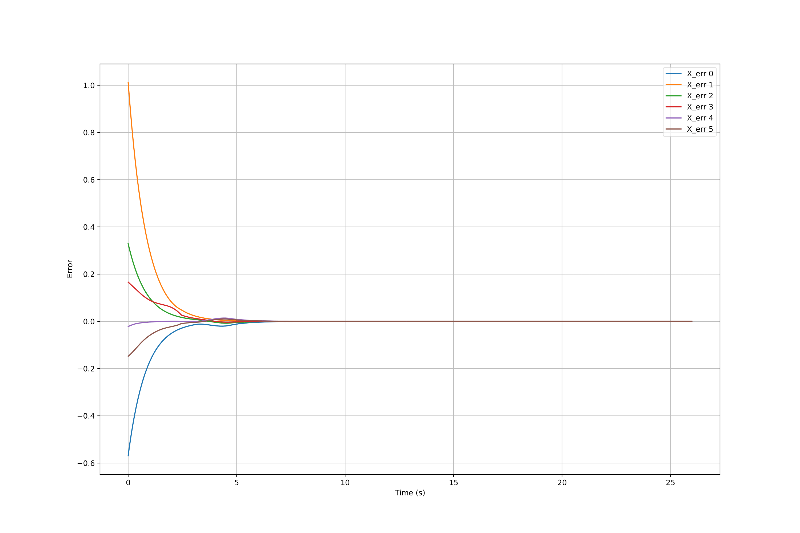
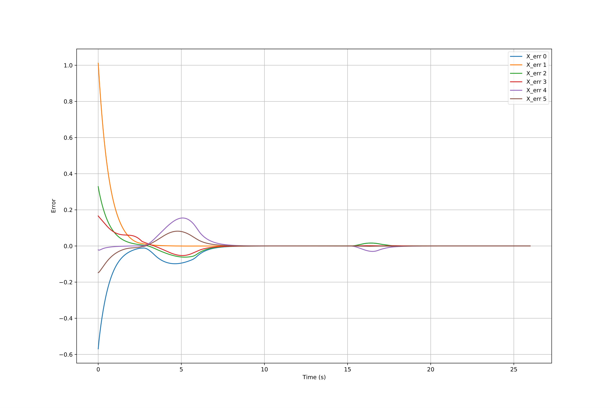

# Mobile-Manipulation

In the coppeliasim, using a youBot mobile manipulator to perform a pick-and-place task for a cube by planning trajectory, performing feedback control, and calculating odometry for the omnidirectional wheels. Joint limit is implemented to avoid self-collision and sigularity.

The code for this project cannot be made public. If you are interested, please email me for more details.

## Dependencies/Packages
```
modern_robotics
numpy
```
## Steps

1. Initialize youBot kinematics
2. Generate trajectory for the end-effector of the arm
3. Start simulation:  
  a. Calculate current state  
  b. Calculate control force for both joints and wheels using feedforward plus PID  
  c. Check joint limit  
  d. Update odometry  
  e. Repeat  
4. Plot  


## youBot Kinematics
- Omni-directional mobile base  
    

- Arm  
  - Dimension and frames  
      
      
      

  - Screw axes with home configuration  
      
      
      
      
      
    

## Odometry

- Wheels  
      

- Arm  
      
    
## Control

     
     
   


  
## Result

### Task 1

Demo:  


Error twist:   



### Task 2

Demo:  


Error twist:  



## Image Credit and Reference

http://hades.mech.northwestern.edu/index.php/ME_449_Robotic_Manipulation
